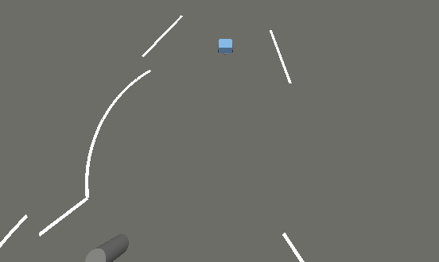

# autonav_sim

A general-purpose **"plug your own robot in"** IGVC AutoNav simulator (ROS 2
Humble + Gazebo Fortress). It drives a real robot stack through a mock
competition course — lane lines, barrels, a ramp, GPS waypoints, and scoring — to
test perception / planning / control.

A robot plugs in via a **robot profile** (identity + geometry) that points at its
URDF; the sim spawns it, publishes camera / lidar / GPS / odom, and subscribes to
`/cmd_vel`. It ships with a bundled **minimal robot** you can clone and run in one
command, and references the real **AutoNav 2025-26** competition robot as the
full-stack example.

## Try it — the bundled minimal robot (no AutoNav needed)



*The bundled `minibot` tracking a lane past a barrel. (Static frame for now — an
animated demo is coming; the current CI VM renders headless on software GL, so a
GPU capture will do it justice.)*

```bash
mkdir -p ws/src && cd ws/src
git clone https://github.com/blobspire/autonav_sim.git
cd .. && colcon build && source install/setup.bash
ros2 launch minimal_robot minimal_demo.launch.py         # headless:=true for no GUI
```

A CPU-only diff-drive robot (`minibot`) spawns and autonomously drives the course
to the finish — no AutoNav packages required. See
**[docs/quickstart.md](docs/quickstart.md)** for details and how to plug in your
own robot.

## Running the AutoNav 2025-26 robot (the full-stack example)

The real competition robot is referenced via `vcs.yaml` and runs alongside the
sim. Its packages (`bringup`, `slam`, `autonav_detection`, `autonav_interfaces`,
custom BT plugins, Nav2 params, URDF, BT XML) come from the active AutoNav
checkout in the same colcon workspace.

See **[docs/examples/autonav_25-26.md](docs/examples/autonav_25-26.md)** for the
**oracle-perception** run — ground-truth lanes + obstacles (no GPU) fed to
AutoNav's Nav2 stack, driving the real robot through the course on CPU.

## Workspace Layout

Use both repos side by side:

```bash
mkdir -p ~/autonav_ws/src
cd ~/autonav_ws/src

# Pick whichever AutoNav branch you want to test.
git clone https://github.com/KazakhStallion/AutoNav_25-26.git AutoNav_25-26
git clone https://github.com/blobspire/autonav_sim.git autonav_sim

cd ~/autonav_ws
source /opt/ros/humble/setup.bash
colcon build --symlink-install
source install/setup.bash
```

Local development without cloning again:

```bash
mkdir -p ~/autonav_ws/src
ln -s ~/code/git/AutoNav_25-26 ~/autonav_ws/src/AutoNav_25-26
ln -s ~/code/git/autonav_sim ~/autonav_ws/src/autonav_sim
cd ~/autonav_ws
source /opt/ros/humble/setup.bash
colcon build --symlink-install
source install/setup.bash
```

`colcon` recursively discovers packages under `src/AutoNav_25-26/isaac_ros-dev/src`
and `src/autonav_sim/igvc_competition_sim`.

Until the old in-tree sim package is removed from AutoNav, disable it in each
workspace so `colcon` does not see two packages named `igvc_competition_sim`:

```bash
touch ~/autonav_ws/src/AutoNav_25-26/isaac_ros-dev/src/igvc_competition_sim/COLCON_IGNORE
```

The bootstrap script does this automatically by default. It is an untracked
workspace-local file, not a source deletion.

## Import With vcs

Import both repos with `vcs.yaml`:

```bash
mkdir -p ~/autonav_ws/src
cd ~/autonav_ws/src
vcs import < /path/to/autonav_sim/vcs.yaml
cd ~/autonav_ws
source /opt/ros/humble/setup.bash
colcon build --symlink-install
```

## Bootstrap Helper

For local setup:

```bash
cd /path/to/autonav_sim
./scripts/bootstrap_workspace.sh
```

Useful overrides:

```bash
AUTONAV_SOURCE=/path/to/AutoNav_25-26 \
SIM_SOURCE=/path/to/autonav_sim \
AUTONAV_WS=~/autonav_ws \
./scripts/bootstrap_workspace.sh --symlink
```

## Running

Full local/headless test:

```bash
cd ~/autonav_ws
source /opt/ros/humble/setup.bash
source install/setup.bash
cd src/autonav_sim/igvc_competition_sim
./Run_IGVC_COMPETITION_FORTRESS_TEST.command
```

Oracle isolation test:

```bash
cd ~/autonav_ws/src/autonav_sim/igvc_competition_sim
./Run_IGVC_COMPETITION_FORTRESS_ORACLE_TEST.command
```

The oracle run uses ground-truth course tape and ground-truth barrel/post
obstacles. Use it to separate robot-stack planning/control failures from
camera-line or PCA perception issues.

Sim-only host:

```bash
cd ~/autonav_ws/src/autonav_sim/igvc_competition_sim
ROS_DOMAIN_ID=42 ROS_LOCALHOST_ONLY=0 RMW_IMPLEMENTATION=rmw_fastrtps_cpp \
  ./Run_IGVC_COMPETITION_FORTRESS_SIM_ONLY.command
```

This launches Gazebo plus the simulation adapters by default: the Gazebo bridge,
camera bridge, sensor harness, odom bridge, calibrated dynamics, and course
monitor. It intentionally does not launch Nav2 or the robot perception stack.

Robot-stack / Jetson host:

```bash
cd ~/autonav_ws/src/autonav_sim/igvc_competition_sim
ROS_DOMAIN_ID=42 ROS_LOCALHOST_ONLY=0 RMW_IMPLEMENTATION=rmw_fastrtps_cpp \
  ./Run_IGVC_COMPETITION_FORTRESS_JETSON_STACK.command
```

This launches the robot stack by default: robot state publisher, detection,
PCA scan converters, GPS waypoint handler, Nav2, MPPI, costmaps, and BT
plugins. It does not launch the sim-only adapters unless
`LAUNCH_SIM_ADAPTERS=true` is explicitly set.

The Jetson wrapper also defaults NumPy/BLAS thread pools to one thread
(`OPENBLAS_NUM_THREADS=1`, `OMP_NUM_THREADS=1`, `MKL_NUM_THREADS=1`,
`NUMEXPR_NUM_THREADS=1`). The GPS waypoint EKF uses very small matrices, so
thread fanout costs more CPU than it saves on the Jetson.

The wrappers default `ROS_WS` to the containing workspace root. Override
`ROS_WS=/path/to/workspace` when running from another location.
If the standalone sim package and robot stack are built in separate workspaces
on the Jetson, set `AUTONAV_ROS_WS=/path/to/AutoNav/isaac_ros-dev` so the
wrapper sources the robot packages before the sim overlay.
For the split Docker setup used by the dual-sim orchestrator, mount this repo
with `AUTONAV_SIM_SOURCE=/home/vtcro/autonav_sim` when starting
`koopa-kingdom`, then run the wrapper from `/autonav_sim/igvc_competition_sim`
with `ROS_WS=/autonav/isaac_ros-dev`.

## Package Boundaries

`igvc_competition_sim` uses package discovery for robot-stack assets:

- `get_package_share_directory("bringup")` for `shogi.urdf`.
- `get_package_share_directory("slam")` for Nav2 params and BT XML.
- `get_package_share_directory("autonav_detection")` for detector launch.
- `autonav_interfaces` as the installed message/action package.

Do not copy those packages into this repo. To test another robot branch, switch
the branch in `~/autonav_ws/src/AutoNav_25-26`, rebuild the workspace, and rerun
the sim.

## Migration Notes

The original `igvc_competition_sim` package remains in AutoNav for now. Safe
removal should happen only after:

1. `autonav_sim` is pushed to its own remote.
2. CI or a developer workspace builds both repos side by side.
3. The full Fortress test and distributed sim/Jetson smoke tests pass from the
   split repo.
4. AutoNav docs/scripts that reference the old package path are updated to point
   at `src/autonav_sim/igvc_competition_sim`.
5. AutoNav removes only the old sim package, not robot packages or shared
   interfaces.
